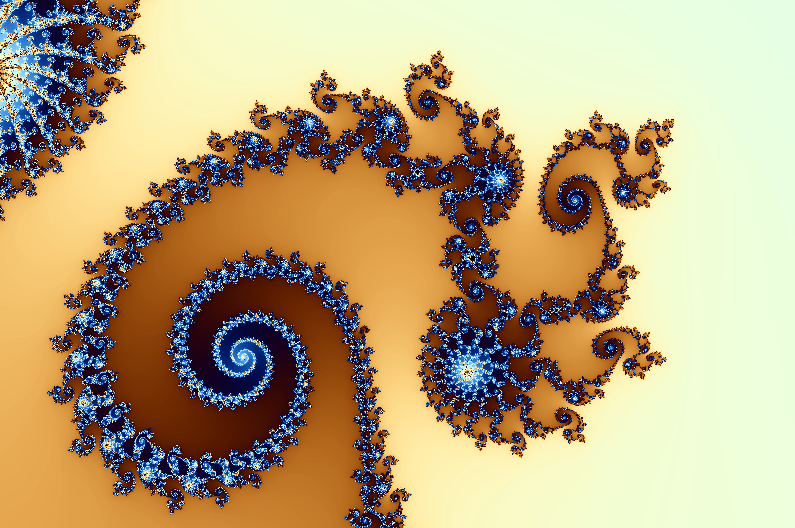
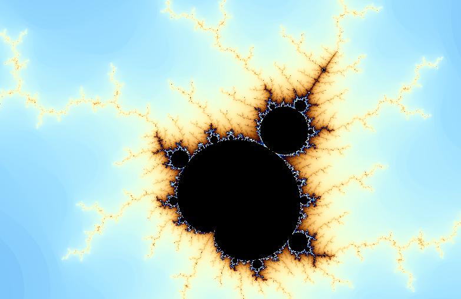
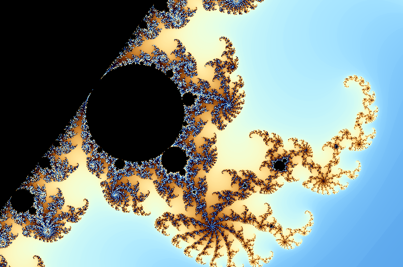

# mandelbrot
A simple program for Mandelbrot set in FreeGlut using smooth colorin similar to the [wikipedia article](https://en.wikipedia.org/wiki/Mandelbrot_set#Continuous_(smooth)_coloring).
## Getting Started
For compile and use this program you need FreeGlut, in GNU/Linux Debian 9.0 you can do this:
```
apt install freeglut3 freeglut3-dev
```
and now you can compile it
```
make
```
Screenshots | a
--- | ---
 | 
 | 
## Autors
* **Cosmo Cat**  [cosmogat](https://github.com/cosmogat)
## License
See the [LICENSE](LICENSE)
